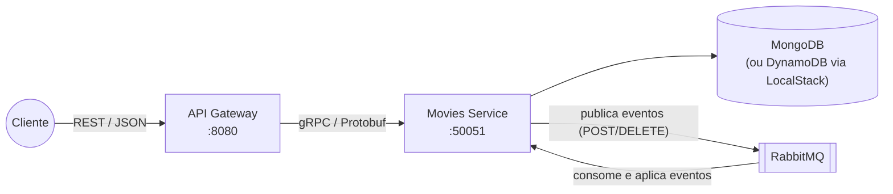

# Movie API

[](https://github.com/teuzowebdeveloper9/movie-api/actions/workflows/ci.yml)
[](https://go.dev)
[](https://opensource.org/licenses/MIT)

API REST para gerenciamento de filmes construída em **Go**, com **Arquitetura Hexagonal**, **microsserviços** comunicando-se via **gRPC/Protobuf**, **MongoDB** (ou **DynamoDB** via LocalStack), escritas assíncronas com **RabbitMQ** e deploy conteinerizado com **Docker**, **Kubernetes** e **Railway**.

## Índice

- [Arquitetura](#arquitetura)
- [Stack](#stack)
- [Como executar](#como-executar)
- [Rotas da API](#rotas-da-api)
- [Swagger](#swagger)
- [Testes](#testes)
- [Variáveis de ambiente](#variáveis-de-ambiente)
- [Estrutura da solução](#estrutura-da-solução)
- [Diferenciais implementados](#diferenciais-implementados)
- [CI/CD](#cicd)
- [Deploy (Railway)](#deploy-railway)
- [Documentação adicional](#documentação-adicional)

## Arquitetura

A aplicação é composta por três containers principais (mais o broker, usado no diferencial event-driven):



| Container | Papel |
|---|---|
| **API Gateway** | Único ponto de entrada público. Expõe a API REST, o Swagger (fora de produção), aplica rate limiting, timeouts e traduz HTTP ⇄ gRPC. |
| **Movies Service** | Dono das regras de negócio. Núcleo hexagonal isolado de banco, broker e transporte. |
| **MongoDB** | Persistência padrão. Trocável por DynamoDB (LocalStack) apenas com variável de ambiente. |
| **RabbitMQ** | Mensageria para o modo event-driven: POST e DELETE são processados de forma assíncrona. |

### Dataset

Os dados são baseados no `movies.json` fornecido junto com o desafio: **28.451 filmes** com os campos `id`, `title` e `year`. Na carga inicial (seed):

- os `id`s originais do arquivo são preservados (ex.: `GET /movies/8`);
- `year`, que vem como string no arquivo (`"1894"`), é normalizado para inteiro;
- a inserção é feita em lote (`CreateMany` na porta do repositório — `InsertMany` no MongoDB, `BatchWriteItem` no DynamoDB), mantendo o boot rápido mesmo com ~28k registros;
- os demais campos do domínio (`cast`, `genres`, `href`, `extract`, `thumbnail`…) são opcionais e podem ser enviados no `POST /movies`.

### Arquitetura Hexagonal (Ports & Adapters)

O serviço Movies segue estritamente a regra de dependência: **o núcleo não importa nada das bordas**.

```
internal/movies/
├── core/
│   ├── domain/       entidade Movie, validações, erros e filtros (regras de negócio puras)
│   ├── ports/        interfaces: MovieRepository, EventPublisher, MovieService, MovieEventApplier
│   └── service/      casos de uso (orquestra domínio + ports)
└── adapters/
    ├── grpcserver/   driving adapter: expõe o núcleo via gRPC
    ├── messaging/    rabbitmq: publisher (driven) e consumer (driving)
    ├── repository/   mongodb, dynamodb e memory implementando o mesmo port
    └── seed/         carga inicial do movies.json
```

Trocar MongoDB por DynamoDB, ou escrita síncrona por assíncrona, não altera **uma linha** do núcleo — apenas a composição no `cmd/movies/main.go`. Detalhes em [docs/architecture.md](docs/architecture.md).

## Stack

| Categoria | Tecnologia |
|---|---|
| Linguagem | Go 1.26 |
| Comunicação entre serviços | gRPC + Protocol Buffers |
| HTTP router | chi v5 |
| Banco de dados | MongoDB 7 (driver v2) / DynamoDB (aws-sdk-go-v2 + LocalStack) |
| Mensageria | RabbitMQ 3.13 (amqp091-go, publisher confirms, DLQ) |
| Documentação | Swagger (swaggo) |
| Testes | testify (assert/require/mock), bufconn |
| Containers | Docker multi-stage + distroless non-root |
| Orquestração | Docker Compose / Kubernetes (Kustomize) |
| CI/CD | GitHub Actions → GHCR → Railway |

## Como executar

### Dependências

- [Docker](https://docs.docker.com/get-docker/) com Docker Compose v2 — **é a única dependência obrigatória**.
- (Opcional, para desenvolvimento) Go 1.26+, `protoc`, `swag` e `golangci-lint`.

### Um único comando

```bash
docker compose up -d --build
```

Isso sobe MongoDB, RabbitMQ, o serviço Movies (com seed automático do `movies.json`) e o API Gateway em `http://localhost:8080`, com healthchecks e ordem de inicialização resolvidos automaticamente.

```bash
curl http://localhost:8080/movies
```

Swagger local: <http://localhost:8080/swagger/index.html>
RabbitMQ management: <http://localhost:15672> (movies/movies)

### Visualizando os dados (mongo-express)

```bash
docker compose --profile tools up -d   # ou: make tools
```

Abre o mongo-express em <http://localhost:8081> (usuário/senha padrão local: `admin`/`admin`, sobrescrevíveis via `MONGO_EXPRESS_USER`/`MONGO_EXPRESS_PASS`). No ambiente do Railway existe um mongo-express equivalente protegido por Basic Auth — a URL e as credenciais ficam nas variables do serviço, fora do repositório.

Para derrubar tudo:

```bash
docker compose down -v
```

### Variante com DynamoDB (LocalStack)

```bash
docker compose -f docker-compose.yml -f docker-compose.localstack.yml up -d --build
```

O serviço Movies passa a persistir no DynamoDB emulado pelo LocalStack — mesma API, mesmo seed, zero mudança de código.

### Com Makefile

```bash
make up            # docker compose up -d --build
make up-dynamodb   # stack com LocalStack/DynamoDB
make down          # derruba e remove volumes
make test          # testes com -race
make lint          # golangci-lint
make proto         # regenera código gRPC
make swagger       # regenera documentação Swagger
```

## Rotas da API

| Método | Rota | Descrição | Sucesso |
|---|---|---|---|
| GET | `/movies` | Lista paginada com filtros (`page`, `page_size`, `title`, `genre`, `year`) | 200 |
| GET | `/movies/{id}` | Busca um filme por ID | 200 |
| POST | `/movies` | Cadastra um filme | 201 (síncrono) / 202 (assíncrono) |
| DELETE | `/movies/{id}` | Remove um filme | 204 (síncrono) / 202 (assíncrono) |
| GET | `/healthz` | Liveness do gateway | 200 |
| GET | `/readyz` | Readiness (verifica o serviço Movies via gRPC health) | 200 |

### Exemplos com curl

```bash
# Listar filmes (paginado — o dataset oficial tem 28.451 registros)
curl "http://localhost:8080/movies?page=1&page_size=5"

# Buscar por título / ano
curl "http://localhost:8080/movies?title=matrix"
curl "http://localhost:8080/movies?year=1994"

# Filtro por gênero (campo opcional — presente em filmes criados via POST)
curl "http://localhost:8080/movies?genre=Drama"

# Buscar um filme por ID (os ids originais do movies.json são preservados)
curl http://localhost:8080/movies/8

# Criar um filme (modo event-driven responde 202 Accepted)
curl -i -X POST http://localhost:8080/movies \
  -H "Content-Type: application/json" \
  -d '{
    "title": "Blade Runner",
    "year": 1982,
    "cast": ["Harrison Ford", "Rutger Hauer"],
    "genres": ["Science Fiction", "Thriller"],
    "extract": "Um blade runner precisa caçar replicantes fugitivos em Los Angeles."
  }'

# Remover um filme (modo event-driven responde 202 Accepted)
curl -i -X DELETE http://localhost:8080/movies/{id}
```

A documentação completa de todas as rotas, códigos de status e payloads de erro está em [docs/api.md](docs/api.md).

## Swagger

Fora de produção, a documentação interativa fica disponível em:

```
http://localhost:8080/swagger/index.html
```

### Por que o Swagger NÃO sobe em produção

**Publicar a especificação da API em produção é entregar de mão beijada o mapa do ataque.** Boa parte do trabalho de um atacante é *reconhecimento*: descobrir quais rotas existem, quais parâmetros aceitam, quais formatos de payload são válidos e onde estão as operações destrutivas. Um Swagger público elimina esse custo — enumera todas as rotas, métodos, esquemas e exemplos prontos para fuzzing e exploração.

Por isso o gateway decide em tempo de execução:

- `APP_ENV != production` → Swagger habilitado (dev, staging, testes);
- `APP_ENV = production` → Swagger **desabilitado por padrão** (a rota `/swagger/*` nem é registrada no router).

Isso não é "segurança por obscuridade" como única defesa — a API continua com validação de entrada, rate limiting, timeouts e erros genéricos em 5xx. É **redução de superfície de ataque**: não oferecer informação de reconhecimento gratuita. A justificativa completa está em [docs/security.md](docs/security.md).

Prova prática — o mesmo binário, comportamentos diferentes por ambiente:

```bash
# Local (APP_ENV=development): documentação disponível para o time
curl -s -o /dev/null -w "%{http_code}\n" http://localhost:8080/swagger/index.html
# 200

# Produção (APP_ENV=production): a rota nem existe
curl -s -o /dev/null -w "%{http_code}\n" https://gateway-production-7813.up.railway.app/swagger/index.html
# 404
```

A especificação continua versionada no repositório (`api/openapi/`) para quem desenvolve — o que não existe é o endpoint público servindo o mapa da API para qualquer um na internet.

## Testes

O projeto cumpre os dois requisitos de teste do desafio:

**Com mocks** (`testify/mock` e stubs do cliente gRPC):
- `internal/movies/core/service` — casos de uso com repositório e publisher mockados (fluxos síncrono/assíncrono, validação, idempotência de eventos, propagação de falhas);
- `internal/gateway/handler` — handlers HTTP com o cliente gRPC mockado (mapeamento de status, headers `Location`, 202/201/204, corpo de erro).

**Sem mocks** (implementações reais):
- `internal/movies/core/domain` — regras de negócio puras (validação, normalização, filtros);
- `internal/movies/adapters/repository/memory` — repositório real em memória (CRUD, paginação, isolamento de dados);
- `internal/movies/adapters/grpcserver` — servidor gRPC real via `bufconn`, com serviço e repositório reais (fluxo CRUD completo de ponta a ponta);
- `internal/movies/adapters/repository/dynamodb` — mapeamento de itens (roundtrip e parsing de timestamps).

```bash
go test -race ./...   # ou: make test
make cover            # relatório de cobertura em HTML
```

## Variáveis de ambiente

### API Gateway

| Variável | Padrão | Descrição |
|---|---|---|
| `HTTP_PORT` (ou `PORT`) | `8080` | Porta HTTP (`PORT` é injetada automaticamente pelo Railway) |
| `MOVIES_GRPC_ADDR` | `localhost:50051` | Endereço gRPC do serviço Movies |
| `APP_ENV` | `development` | `production` desabilita o Swagger |
| `SWAGGER_ENABLED` | derivado de `APP_ENV` | Força habilitar/desabilitar o Swagger |
| `RATE_LIMIT_RPM` | `300` | Requisições por minuto por IP |
| `REQUEST_TIMEOUT` | `15s` | Timeout por requisição |
| `LOG_LEVEL` | `info` | `debug`, `info`, `warn`, `error` |

### Movies Service

| Variável | Padrão | Descrição |
|---|---|---|
| `GRPC_PORT` | `50051` | Porta do servidor gRPC |
| `DB_DRIVER` | `mongo` | `mongo`, `dynamodb` ou `memory` |
| `MONGO_URI` | `mongodb://localhost:27017` | Connection string do MongoDB |
| `MONGO_DATABASE` | `movies` | Nome do database |
| `DYNAMODB_ENDPOINT` | vazio | Endpoint do LocalStack (ex.: `http://localstack:4566`) |
| `AWS_REGION` | `us-east-1` | Região AWS |
| `DYNAMODB_TABLE` | `movies` | Nome da tabela |
| `RABBITMQ_URL` | vazio | URL AMQP; vazio desabilita o modo event-driven |
| `ASYNC_WRITES` | `true` | Com `RABBITMQ_URL` definido, ativa escritas assíncronas |
| `SEED_ENABLED` | `true` | Seed idempotente do `movies.json` na inicialização |
| `SEED_FILE` | `movies.json` | Caminho do dataset |
| `LOG_LEVEL` | `info` | Nível de log |

## Estrutura da solução

```
.
├── api/openapi/            especificação Swagger gerada (swag)
├── cmd/
│   ├── gateway/            entrypoint do API Gateway
│   └── movies/             entrypoint do serviço Movies (composition root)
├── deploy/k8s/             manifests Kubernetes (Kustomize)
├── docker/                 Dockerfiles multi-stage (distroless, non-root)
├── docs/                   documentação de arquitetura, segurança, trade-offs e deploy
├── gen/movies/v1/          código gRPC gerado a partir do proto
├── internal/
│   ├── gateway/            config, handlers REST, router e middlewares
│   ├── movies/             núcleo hexagonal + adapters (detalhado acima)
│   └── pkg/                helpers compartilhados (env, logging)
├── proto/movies/v1/        contrato Protobuf (fonte da verdade da comunicação)
├── docker-compose.yml      stack completa em um comando
├── docker-compose.localstack.yml  override para DynamoDB/LocalStack
├── movies.json             dataset de seed
└── .github/workflows/      pipeline CI/CD
```

## Diferenciais implementados

| Diferencial | Implementação |
|---|---|
| **Kubernetes** | Manifests completos em `deploy/k8s` (Deployments, StatefulSet, Services, Ingress, HPA, probes gRPC/HTTP, securityContext). Guia em [docs/kubernetes.md](docs/kubernetes.md). |
| **Event-Driven** | POST/DELETE assíncronos via RabbitMQ com publisher confirms, consumer idempotente e Dead Letter Queue. A API responde `202 Accepted` + `Location`. Detalhes em [docs/event-driven.md](docs/event-driven.md). |
| **Cloud Computing (LocalStack)** | Repositório DynamoDB completo emulado pelo LocalStack, selecionável por `DB_DRIVER=dynamodb` — demonstração prática do valor da arquitetura hexagonal. Validado localmente **e ao vivo no Railway** (relato em [docs/deploy-railway.md](docs/deploy-railway.md)). |

## CI/CD

Pipeline em GitHub Actions ([.github/workflows/ci.yml](.github/workflows/ci.yml)):

1. **Lint** — `golangci-lint` (staticcheck, errcheck, gocritic, misspell, gofmt, goimports);
2. **Testes** — `go test -race` com relatório de cobertura no summary do job;
3. **Build** — compilação de todos os binários;
4. **Docker** — build e push das imagens `gateway` e `movies` para o **GitHub Container Registry** (tags `latest`, `sha-*` e semver em releases), com cache de camadas;
5. **Deploy** — redeploy automático dos serviços no Railway via API GraphQL (quando `RAILWAY_TOKEN` está configurado nos secrets).

Pull requests executam lint + testes + build; push na `main` adiciona a publicação das imagens e o deploy.

## Deploy (Railway)

**API em produção:** <https://gateway-production-7813.up.railway.app/movies>

O deploy usa as **imagens Docker geradas pelo CI** (GHCR), publicadas no [Railway](https://railway.app). A escolha do Railway é justificada em [docs/trade-offs.md](docs/trade-offs.md): deploy simples, suporte nativo a imagens Docker de registries públicos, rede privada entre serviços e provisionamento de MongoDB/RabbitMQ na mesma plataforma — sem necessidade de gerenciar infraestrutura.

Em produção o gateway roda com `APP_ENV=production`, portanto **sem Swagger publicado** (ver [Swagger](#swagger)). O passo a passo completo do deploy está em [docs/deploy-railway.md](docs/deploy-railway.md).

## Documentação adicional

| Documento | Conteúdo |
|---|---|
| [docs/architecture.md](docs/architecture.md) | Arquitetura hexagonal, fluxos de requisição, decisões estruturais |
| [docs/api.md](docs/api.md) | Referência completa das rotas com exemplos curl e respostas |
| [docs/security.md](docs/security.md) | Postura de segurança: Swagger em produção, rate limiting, containers, erros |
| [docs/trade-offs.md](docs/trade-offs.md) | Trade-offs e justificativas das escolhas técnicas |
| [docs/event-driven.md](docs/event-driven.md) | Mensageria: topologia, idempotência, DLQ, semântica 202 |
| [docs/kubernetes.md](docs/kubernetes.md) | Como executar no Kubernetes (kind/minikube) |
| [docs/deploy-railway.md](docs/deploy-railway.md) | Deploy com imagens Docker no Railway + CI/CD |
