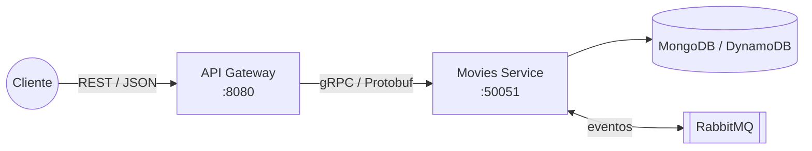

# Arquitetura

## Visão geral

O sistema é composto por dois serviços próprios e duas dependências de infraestrutura:



- **API Gateway** — borda pública do sistema. Não contém regra de negócio: valida o formato da requisição, aplica políticas de borda (rate limiting, timeout, tamanho máximo de payload) e traduz HTTP ⇄ gRPC.
- **Movies Service** — dono do domínio. Toda regra de negócio vive aqui, protegida por uma arquitetura hexagonal.
- **MongoDB / DynamoDB** — persistência, plugável via port.
- **RabbitMQ** — transporte de eventos para escritas assíncronas (diferencial event-driven).

A comunicação entre gateway e serviço usa **gRPC com Protocol Buffers**. O contrato (`proto/movies/v1/movies.proto`) é a fonte da verdade; o código Go em `gen/` é gerado por `make proto` e versionado no repositório para que build e CI não dependam do `protoc`.

## Arquitetura Hexagonal no Movies Service

```
                      ┌──────────────────────────────────────────┐
   driving adapters   │                  CORE                    │   driven adapters
                      │                                          │
  ┌─────────────┐     │  ┌─────────┐  ┌─────────┐  ┌──────────┐  │     ┌──────────────┐
  │ gRPC server ├──►──┼──┤  ports  ├──┤ service ├──┤  domain  │  │  ┌──┤ mongodb repo │
  └─────────────┘     │  │(driving)│  └────┬────┘  └──────────┘  │  │  ├──────────────┤
  ┌─────────────┐     │  └─────────┘       │       ┌──────────┐  │  │  │ dynamodb repo│
  │  rabbitmq   ├──►──┼────────────────────┴───►───┤  ports   ├──┼──┤  ├──────────────┤
  │  consumer   │     │                            │ (driven) │  │  │  │ memory repo  │
  └─────────────┘     │                            └──────────┘  │  │  ├──────────────┤
                      │                                          │  └──┤ rabbitmq pub │
                      └──────────────────────────────────────────┘     └──────────────┘
```

### Regra de dependência

| Camada | Pode importar | Nunca importa |
|---|---|---|
| `core/domain` | stdlib | qualquer outra camada |
| `core/ports` | `domain` | adapters, drivers, frameworks |
| `core/service` | `domain`, `ports` | adapters, drivers, frameworks |
| `adapters/*` | `core/*`, drivers externos | outros adapters |
| `cmd/movies` | tudo (composition root) | — |

O núcleo (`core/`) não conhece MongoDB, DynamoDB, RabbitMQ, gRPC nem HTTP. Quem liga as pontas é o composition root (`cmd/movies/main.go`), que decide em tempo de inicialização, por variável de ambiente:

- qual `MovieRepository` usar (`DB_DRIVER=mongo|dynamodb|memory`);
- se as escritas são síncronas ou assíncronas (`RABBITMQ_URL` + `ASYNC_WRITES`).

### Ports

| Port | Direção | Implementações |
|---|---|---|
| `MovieService` | driving (o mundo chama o núcleo) | `core/service.MovieService` |
| `MovieEventApplier` | driving (consumer aplica eventos) | `core/service.MovieService` |
| `MovieRepository` | driven (o núcleo chama o mundo) | `mongodb`, `dynamodb`, `memory` |
| `EventPublisher` | driven | `rabbitmq.Publisher` |

## Fluxos de requisição

### Leitura (GET /movies, GET /movies/{id})

```
Cliente → Gateway (REST) → gRPC → grpcserver → service → repository → banco
```

Sempre síncrona. Erros de domínio são mapeados duas vezes: `domain.ErrNotFound` → `codes.NotFound` (gRPC) → `404` (HTTP).

### Escrita síncrona (sem RabbitMQ)

```
POST /movies → gateway → CreateMovie (gRPC) → service.Create → repository.Create → 201 Created
```

### Escrita assíncrona (event-driven, padrão no Compose)

```
POST /movies → gateway → CreateMovie (gRPC) → service.Create
    → publisher.MovieCreateRequested → RabbitMQ (confirmação do broker)
    → resposta OPERATION_STATUS_ACCEPTED → HTTP 202 + Location: /movies/{id}

RabbitMQ → consumer → service.ApplyCreate → repository.Create
```

O ID é gerado **antes** da publicação, então o cliente já recebe o `Location` definitivo do recurso. Detalhes de idempotência e DLQ em [event-driven.md](event-driven.md).

## API Gateway

O gateway aplica o mesmo princípio de camadas em versão reduzida (não há domínio):

- `internal/gateway/config` — configuração por ambiente;
- `internal/gateway/handler` — tradução HTTP ⇄ gRPC + DTOs + mapeamento de erros;
- `internal/gateway/router` — middleware stack: request ID, resolução de IP do cliente, logging estruturado, recover de panics, timeout, rate limit por IP, rotas de health e Swagger condicional.

## Observabilidade

- Logs estruturados em JSON (`log/slog`) nos dois serviços, com `service`, `request_id`, método, duração e status;
- `/healthz` e `/readyz` no gateway; gRPC Health Checking Protocol no Movies (usado pelo probe nativo do Kubernetes e pelos healthchecks do Compose);
- Interceptors gRPC de logging e recovery no servidor.

## Decisões estruturais

- **Monorepo com dois binários** (`cmd/gateway`, `cmd/movies`): compartilha o contrato gerado e simplifica CI, mantendo containers e ciclos de deploy independentes;
- **Código gerado versionado** (`gen/`, `api/openapi`): builds reproduzíveis sem toolchain de geração instalada;
- **Binários distroless não-root** com subcomando `healthcheck` embutido, já que imagens distroless não têm shell/curl para probes.

Justificativas completas em [trade-offs.md](trade-offs.md).
